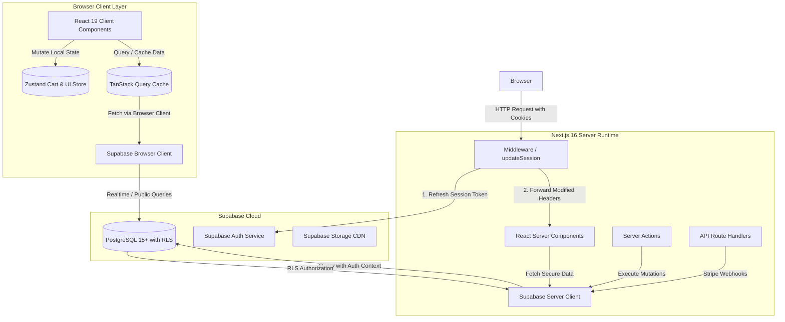
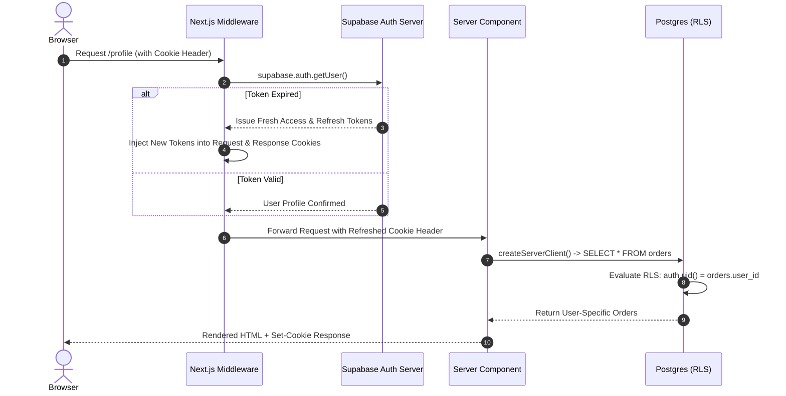

# UrbanNest System Architecture Blueprint

This document defines the high-level architecture, design patterns, data flows, and engineering standards for the **UrbanNest** e-commerce platform.

---

## 1. System Topology & Data Flow



---

## 2. Monorepo Organization (Turborepo)

The repository is structured as a **Turborepo** monorepo managed by **pnpm**:

```text
urbannest/
├── apps/
│   ├── web/                     # Main Next.js 16 App Router storefront & admin
│   └── docs/                    # Internal team documentation site
├── packages/
│   ├── ui/                      # Shared design tokens & cross-app primitives
│   ├── eslint-config/           # Centralized ESLint flat configs
│   └── typescript-config/       # Base tsconfig extensions
├── docs/                        # Architectural, database, and interview specs
├── package.json                 # Monorepo root scripts and packageManager definition
└── turbo.json                   # Pipeline caching rules (build, lint, check-types)
```

### Boundary Principles
1. **Isolated Apps**: `apps/web` contains the business logic, route handlers, and domain features.
2. **Shared Configurations**: Linting and TypeScript rules are inherited from `@repo/eslint-config` and `@repo/typescript-config`.
3. **Workspace Invalidation**: Turborepo caches pipeline outputs; changing code in `apps/web` will not force a rebuild of other packages unless their dependency graph intersects.

---

## 3. Next.js 16 App Router Conventions

### Server vs. Client Boundary Rules
- **Server Components (Default)**:
  - Used for pages, layouts, initial data fetching, and metadata generation.
  - Keeps large dependencies (Markdown parsers, database drivers) on the server, resulting in zero client JavaScript bundle impact.
  - Direct access to `createServerClient` and database queries with instant RLS enforcement.
- **Client Components (`'use client'`)**:
  - Used strictly for interactive sub-trees: interactive dropdowns, animated cart drawer, add-to-cart buttons, and form inputs.
  - Pushed to the leaves of the component tree to maximize server-rendered HTML.

### Directory Structure Pattern (Feature-Sliced Inside `apps/web`)

```text
apps/web/
├── app/                  # Route entry points, layouts, and endpoints
├── components/           # Presentation primitives decoupled from domain logic
│   ├── ui/               # Headless ShadCN primitives (Button, Dialog, Input)
│   ├── layout/           # Shared structural layout (Navbar, Footer)
│   └── shared/           # Composite UI components (RatingStars, EmptyState)
├── features/             # Domain-specific modules (Feature-Sliced Design)
│   ├── auth/             # Login, signup, user session state
│   ├── products/         # Catalog grid, filters, detail view, product cards
│   ├── cart/             # Cart drawer, calculations, line item controls
│   ├── orders/           # Checkout steps, order receipts, status timelines
│   └── admin/            # Inventory tables, product forms, catalog controls
├── lib/                  # Infrastructure SDKs, validations, utilities
├── hooks/                # Cross-feature custom React hooks
├── providers/            # Top-level React context providers
├── stores/               # Zustand global state slices
└── types/                # Global TypeScript contracts and DB schemas
```

---

## 4. Supabase SSR & Cookie Authentication Flow

Authentication in UrbanNest is stateless and token-based, using JSON Web Tokens (JWTs) stored in secure HTTP-only cookies.



### Key Rules
1. **Asynchronous Cookies**: Next.js 16 requires awaiting `cookies()`. `server.ts` handles `await cookies()` and catches server-component writes safely.
2. **`auth.getUser()` over `auth.getSession()`**: `getSession()` only inspects the local unverified cookie payload, which can be spoofed. `getUser()` guarantees cryptographically secure verification against the Supabase Auth server.

---

## 5. State Management Matrix

| State Type | Solution | Storage Location | Example Use Case |
| :--- | :--- | :--- | :--- |
| **Server Remote State** | Next.js Server Components / React 19 Cache | Server / HTTP Cache | Product detail specifications, category hierarchies |
| **Dynamic Remote Cache** | TanStack Query v5 | Client Memory | Real-time catalog filtering, search suggestions, review polling |
| **Client UI State** | Zustand | LocalStorage / Memory | Shopping cart contents, cart drawer open/close, active promo code |
| **URL Search State** | Next.js `useSearchParams` | Browser URL Query String | Active category filter, price range slider, sort order (`?sort=price_asc`) |
| **Transient Local State** | React `useState` / `useReducer` | Component Memory | Input validation errors, image gallery active thumbnail index |

---

## 6. Styling & Design System

- **Tailwind CSS v4**: Utilizes `@import "tailwindcss";` without legacy `tailwind.config.js`. Uses the `@theme inline` block for custom design tokens.
- **Color Spaces**: Uses modern `oklch(...)` color spaces for uniform perceived lightness across both light and dark modes.
- **Component Primitives**: Uses ShadCN "base-nova" powered by `@base-ui/react` for accessible, unstyled interactive primitives paired with Tailwind utility styling.
- **Class Merging**: Standard `twMerge(clsx(inputs))` encapsulated in `@/lib/utils` ensures utility conflicts are resolved deterministically.

---

## 7. Security Architecture

1. **Row Level Security (RLS)**: PostgreSQL enforces data isolation at the engine level. Even if a client bypasses the application layer, they cannot query another user’s cart or orders.
2. **Environment Variable Segregation**:
   - `NEXT_PUBLIC_*`: Exposed to client bundle (Supabase URL, Anon Key). Safe under RLS.
   - `SUPABASE_SERVICE_ROLE_KEY`: Never exposed to the browser; used only in protected server-side administrative route handlers.
3. **Runtime Schema Validation**: All user submissions (forms, query params, server action payloads) are sanitized and validated with **Zod** schemas before reaching the database.
