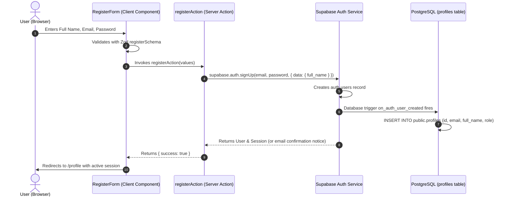
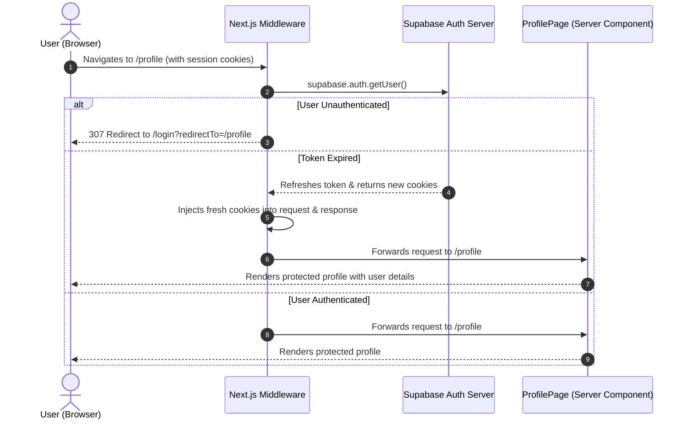
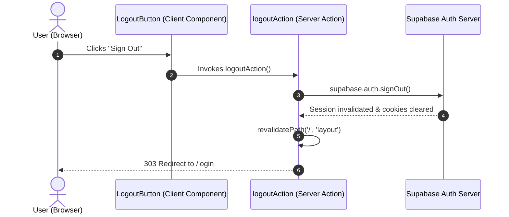

# UrbanNest Authentication Architecture & Flow Guide

Comprehensive architectural documentation for authentication and session management in **UrbanNest**, powered by **Next.js 16 App Router** and **Supabase Auth**.

---

## 1. Core Definitions

### What is Authentication (AuthN)?
**Authentication** is the process of verifying *who a user is*. When a customer signs up or logs into UrbanNest using their email and password (or OAuth provider), the authentication system verifies their identity against stored credentials and cryptographically signs a token proving identity.

### What is Authorization (AuthZ)?
**Authorization** is the process of verifying *what permissions an authenticated user has*. Once identity is confirmed, the system determines what resources that user can access. For example:
- A user with the role `'customer'` is authorized to view only their own cart and past orders (`auth.uid() = user_id`).
- A user with the role `'admin'` is authorized to create products, update stock quantities, and view all customer orders.

### What is a Session?
A **Session** is the sustained, authenticated state between the client and the server across multiple HTTP requests without requiring the user to re-enter their password on every navigation. In modern SSR architectures, sessions are maintained using cryptographically signed **JSON Web Tokens (JWTs)** stored inside secure, HTTP-only browser cookies.

### How Supabase Auth Works
1. **User Registration / Login**: The client transmits credentials to Supabase Auth.
2. **Token Issuance**: Supabase validates credentials and issues two tokens:
   - **Access Token (JWT)**: Short-lived token (default: 1 hour) containing user claims, user ID (`sub`), and role. It is attached to every Supabase database request to evaluate PostgreSQL Row Level Security (RLS).
   - **Refresh Token**: Long-lived single-use token used to obtain a new access token when the current access token expires.
3. **Cookie Storage via `@supabase/ssr`**: Unlike single-page client apps that store tokens in vulnerable `localStorage`, `@supabase/ssr` stores tokens in HTTP-only, secure, partitioned cookies.
4. **Middleware Session Refresh**: Before any server component renders, Next.js Edge Middleware inspects the cookie. If the access token is near expiry or expired, it uses the refresh token to silently retrieve a fresh token pair, writing it to both the incoming request headers and outgoing response cookies.

---

## 2. Authentication Flow Diagrams

### 2.1 Sign Up Flow

### 2.2 Sign In & Middleware Protection Flow

### 2.3 Logout Flow

---

## 3. Security Implementation Details

1. **Zod Runtime Schema Validation**: All user inputs (names, emails, passwords, password confirmations) are strictly sanitized and validated before transmission to the database.
2. **Server-Side Token Verification**: Uses `supabase.auth.getUser()` rather than `getSession()`. `getUser()` sends a validation request to Supabase Auth servers, preventing JWT spoofing attacks.
3. **HTTP-Only Cookies**: Tokens are inaccessible to malicious JavaScript or third-party browser extensions (mitigating XSS token theft).
4. **Row Level Security (RLS)**: Even if a client bypasses the frontend and queries the database directly, PostgreSQL enforces `auth.uid() = id`, making it physically impossible to view or edit another user's data.
