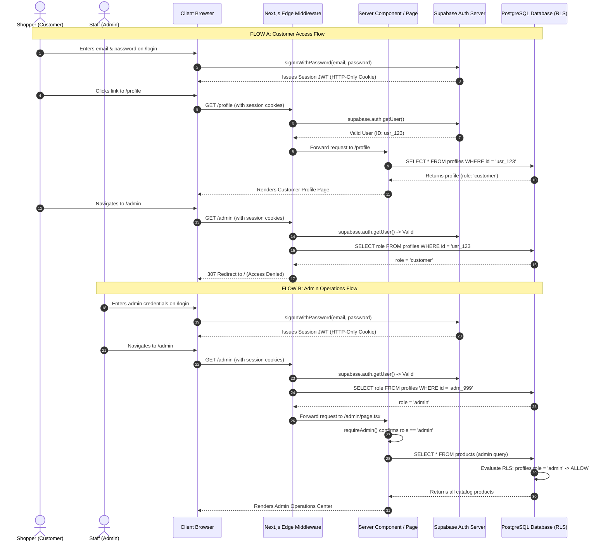

# UrbanNest Role-Based Authorization Flow Architecture (RBAC)

A comprehensive architectural reference and interview guide explaining how **Role-Based Access Control (RBAC)** operates across Edge Middleware, Server Components, and PostgreSQL Row Level Security (RLS) in **UrbanNest**.

---

## 1. High-Level Authorization Architecture

UrbanNest enforces a **three-tier defense-in-depth authorization model**:

```text
[HTTP Request]
      │
      ▼
┌────────────────────────────────────────────────────────┐
│ 1. EDGE MIDDLEWARE LAYER (middleware.ts)               │
│    • Refreshes expired session tokens silently         │
│    • Blocks unauthenticated visitors -> /login         │
│    • Prevents customers from accessing /admin -> /     │
└─────────────────────────┬──────────────────────────────┘
                          │ (Allowed)
                          ▼
┌────────────────────────────────────────────────────────┐
│ 2. SERVER COMPONENT / ACTION GUARD LAYER               │
│    • requireAdmin() / requireAuth() in roles.ts        │
│    • Ensures unauthorized UI or data never serializes  │
│    • Zero client-bundle leakage                        │
└─────────────────────────┬──────────────────────────────┘
                          │ (Executing Query)
                          ▼
┌────────────────────────────────────────────────────────┐
│ 3. DATABASE ENGINE LAYER (PostgreSQL RLS)              │
│    • Evaluates auth.uid() & profiles.role = 'admin'    │
│    • Engine-level authorization on every SQL statement │
│    • Untamperable by client-side spoofing              │
└────────────────────────────────────────────────────────┘
```

---

## 2. End-to-End Sequence Diagram



---

## 3. Deep-Dive: Layer-by-Layer Flow Analysis

### Layer 1: Edge Middleware Flow
**File:** [apps/web/lib/supabase/middleware.ts](file:///d:/WEBZINTH/week%2015/urbannest/apps/web/lib/supabase/middleware.ts)

```text
Incoming Request to /admin/*
          │
          ▼
Is user session valid? (auth.getUser())
         ├── NO  ──> Redirect to /login?redirectTo=/admin
         │
         └── YES
              │
              ▼
Fetch public.profiles.role from PostgreSQL
              │
              ├── Role === 'admin'    ──> Allow request to proceed (NextResponse.next())
              │
              └── Role !== 'admin'    ──> Redirect to / (Home storefront)
```

#### Why it matters in an interview:
- **Zero Compute Waste**: Unauthorized requests are intercepted at the edge network before Next.js wastes CPU rendering React Server Components.
- **Silent Token Rotation**: If an admin’s short-lived JWT expired while browsing, middleware refreshes the session before reaching the role check, preventing unexpected 403s or logouts.

---

### Layer 2: Server Component Guard Flow (`requireAdmin`)
**File:** [apps/web/features/auth/roles.ts](file:///d:/WEBZINTH/week%2015/urbannest/apps/web/features/auth/roles.ts)

```typescript
export async function requireAdmin(redirectTo: string = "/admin") {
  const current = await getCurrentUser();

  if (!current?.user) {
    redirect(`/login?redirectTo=${encodeURIComponent(redirectTo)}`);
  }

  if (current.role !== "admin") {
    redirect("/");
  }

  return current;
}
```

```text
Server Component begins execution
          │
          ▼
Calls const { user, profile } = await requireAdmin()
          │
          ├── Unauthenticated  ──> Next.js throws NEXT_REDIRECT to /login
          │
          ├── Non-Admin User   ──> Next.js throws NEXT_REDIRECT to /
          │
          └── Verified Admin   ──> Returns typed profile; renders page
```

#### Why it matters in an interview:
- **Defense-in-Depth**: Never rely exclusively on middleware. If a developer accidentally misconfigures the middleware `matcher` regex, `requireAdmin()` inside the page or Server Action guarantees that unauthorized users can **never** execute privileged mutations or receive sensitive payload data.
- **Zero Client Bundle**: `roles.ts` is purely server-side. No authorization logic or administrative secrets ever leak into the client JavaScript bundle.

---

### Layer 3: Database Engine Security (PostgreSQL RLS Flow)
**File:** [docs/SQL_QUERIES.sql](file:///d:/WEBZINTH/week%2015/urbannest/docs/SQL_QUERIES.sql)

```sql
CREATE POLICY "Admins can manage products" ON public.products
  FOR ALL USING (
    EXISTS (SELECT 1 FROM public.profiles WHERE id = auth.uid() AND role = 'admin')
  );
```

```text
Client / Server sends SQL: UPDATE products SET stock = 10 WHERE id = ...
                          │
                          ▼
PostgreSQL receives request with JWT Auth context (auth.uid())
                          │
                          ▼
PostgreSQL evaluates RLS Policy:
EXISTS (SELECT 1 FROM public.profiles WHERE id = auth.uid() AND role = 'admin')
                          │
                          ├── Sub-query returns 1 row (admin) ──> Query Executes
                          │
                          └── Sub-query returns 0 rows        ──> 0 Rows Updated (or Error)
```

#### Why it matters in an interview:
- **Engine-Enforced Security**: Even if an attacker uses the public Supabase anon key to call `supabase.from('products').delete()` directly through Postman or curl, PostgreSQL rejects the statement at the database layer.
- **Index Optimization**: `profiles.id` is the primary key. The RLS sub-query executes as a sub-millisecond B-tree index seek.

---

## 4. Senior Interview Q&A Cheatsheet

### Q1: Why not store roles in custom JWT claims (`app_metadata`) instead of a database column?
> *"Storing roles in the database `profiles.role` column provides **immediate revocation and promotion**. If an admin is compromised or offboarded, a SQL update (`UPDATE profiles SET role = 'customer' WHERE email = '...'`) takes effect on the very next HTTP request. With JWT custom claims, the user remains an admin until their token expires (typically 1 hour) unless you maintain an active token revocation blocklist, which introduces caching complexity."*

### Q2: Why use both Middleware checks AND Server Component guards?
> *"This is the **Principle of Defense-in-Depth**. Middleware acts as a fast outer gatekeeper at the edge network to reject unauthorized traffic before SSR. However, middleware matchers can be accidentally bypassed (e.g., misconfigured route prefixes or direct Server Action RPC calls). Having `requireAdmin()` inside the page and Server Action guarantees absolute zero-trust execution."*

### Q3: What happens if a customer manually crafts a POST request to an admin Server Action?
> *"Every administrative Server Action calls `await requireAdmin()`. When the action executes on the server, it reads the caller's session cookies, queries `public.profiles`, sees `role = 'customer'`, and immediately throws a redirect or authorization error. Furthermore, even if the Server Action lacked a check, PostgreSQL Row Level Security would reject the underlying `INSERT` or `UPDATE` statement."*
